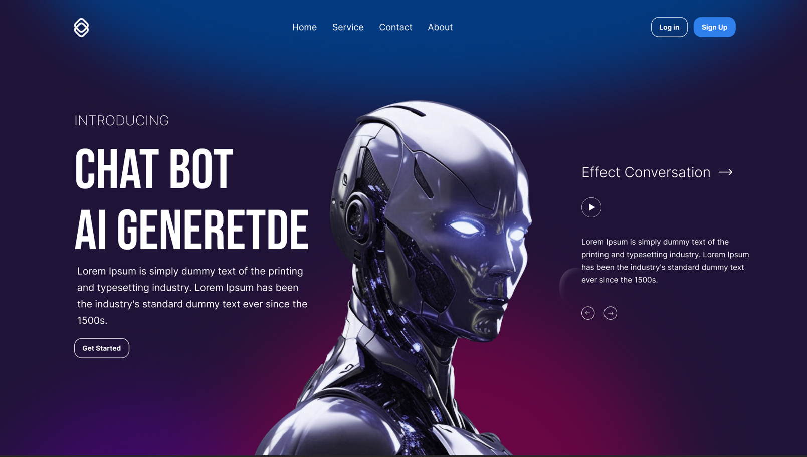

# React + Vite

This template provides a minimal setup to get React working in Vite with HMR and some ESLint rules.


Currently, two official plugins are available:

- [@vitejs/plugin-react](https://github.com/vitejs/vite-plugin-react/blob/main/packages/plugin-react/README.md) uses [Babel](https://babeljs.io/) for Fast Refresh
- [@vitejs/plugin-react-swc](https://github.com/vitejs/vite-plugin-react-swc) uses [SWC](https://swc.rs/) for Fast Refresh

- * Figma Design :- https://www.figma.com/file/F9pcbnU5eUH6q9oUzm6Opn/Ai-ChatBot-UI?type=design&node-id=0-1&mode=design&t=skqj8RWLoruQ0Q08-0

# Preview



* Link For Project View - https://vimeo.com/936282959?share=copy
* Figma Design :- https://www.figma.com/file/F9pcbnU5eUH6q9oUzm6Opn/Ai-ChatBot-UI?type=design&node-id=0-1&mode=design&t=skqj8RWLoruQ0Q08-0

  
## Installation

Install For View Home Page:-

```bash

  git clone https://github.com/Garrur/Chat-Bot-UI.git
      
  npm init  
  
  npm install

  install TailwindCss

  npm run dev
```
```
 For TailwindCss Installation:- https://tailwindcss.com/docs/guides/vite

```
For view Chat interface - http://localhost:3000/cha/interface.html
